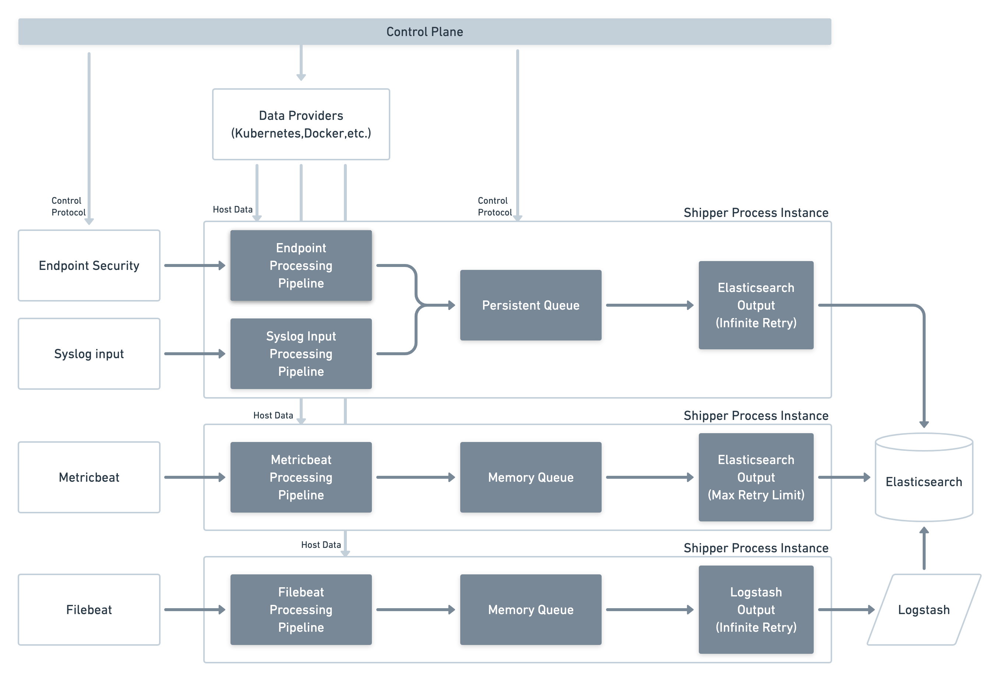

# elastic-agent-shipper

> :warning: The Elastic agent data shipper is under active development, and will be available as an opt-in beta feature in an upcoming Elastic agent release.

Data shipper for the Elastic Agent - a single, unified way to add monitoring for logs, metrics, and
other types of data to a host.

The data shipper is a new process in the Elastic agent system designed to centralize local data
processing, queueing, and publishing to the target output (Elasticsearch, Logstash, etc.).

The data shipper is a part of a larger effort to rearchitect the Elastic agent. In the initial Elastic
agent architecture each underlying data collector (e.g. Filebeat) was required to implement its own
processing, queueing, and output connection(s) for each supported output type. The data shipper
simplifies this architecture by allowing data collectors to implement a single gRPC client to
process, queue, and publish data. The initial design goals of the data shipper are to:

- Remove the need for processing, queueing, and output protocols to be reimplemented in each input.
- Minimize the number of output connections required in Elastic agent deployments.
- Simplify configuration and performance tuning of Elastic agent data pipelines.
- Make Elastic agent data pipelines more observable and easier to debug.
- Improve on or maintain the performance of the existing Beats outputs.
- Define the event publishing interface all current and future Elastic agent data inputs will use.

Each output in an agent policy will map to a separate instance of the shipper process:


## Client Development

Data shipper clients must implement the shipper [gRPC API](https://github.com/elastic/elastic-agent-shipper-client/tree/main/api).
The reference client is the [Beats shipper output](https://github.com/elastic/beats/tree/main/libbeat/outputs/shipper), which is
used by Beats like Filebeat and Metricbeat when they are started by Elastic agent integrations. 

Data shipper support in the Elastic Agent is under active development.

The shipper currently can be run in 2 modes:

* Under Elastic agent (managed mode): the main mode for running in production environments
* Using a local config file (unmanaged mode): is supposed to be used for local development and testing

To run the shipper in the unmanaged mode use this flag on the built binary:

```sh
./elastic-agent-shipper run -c elastic-agent-shipper.yml
```

Where `elastic-agent-shipper.yml` is a path to a local configuration file. The [reference shipper configuration file](https://github.com/elastic/elastic-agent-shipper/blob/main/elastic-agent-shipper.yml) defines the available
configuration options.

## Contributing

The process for contributing to any of the Elastic repositories is similar.

1. Please make sure you have signed our [Contributor License Agreement](https://www.elastic.co/contributor-agreement/). 
We are not asking you to assign copyright to us, but to give us the right to distribute your code
without restriction. We ask this of all contributors in order to assure our users of the origin and
continuing existence of the code. You only need to sign the CLA once.

2. Send a pull request! Push your changes to your fork of the repository and [submit a pull
request](https://help.github.com/articles/using-pull-requests). New PRs go to the main branch. The
development team will backport your PR to previous release branches if necessary. In the pull request, describe what
your changes do and mention any bugs/issues related to the pull request. 

### Developing
The data shipper is developed in [Go](http://golang.org/) so install the [version](https://github.com/elastic/elastic-agent-shipper/blob/main/.go-version) 
which is being used for shipper development. One deterministic manner to install the proper Go version to work with the shipper is to use the
[GVM](https://github.com/andrewkroh/gvm) Go version manager.

The data shipper primarily uses the [mage](https://magefile.org/) build system. The list of supported mage commands can be obtained
by running `mage -l` from the root of the repository. The most commonly used commands are:

* `mage build` to build the data shipper binary.
* `mage check` to check license files and dependencies.
* `mage lint` to lint the source code using [golangci-lint](https://golangci-lint.run/).
* `go test ./...` to run all tests.

Run mage commands with the `-v` flag for more detailed output, for example `mage -v check`.
